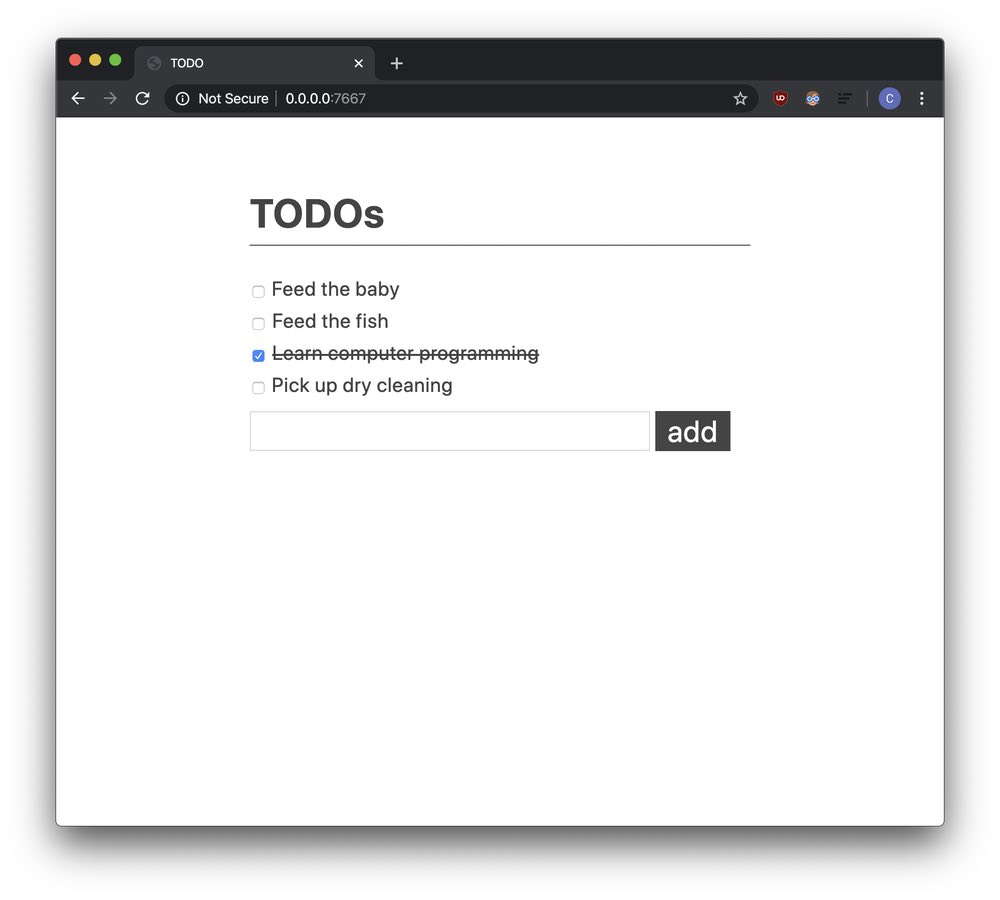

# TODO Example App

A very basic server-side TODO app, based on [vial-todo].

Written with [Vial] and [Rustbreak].

[vial]: https://github.com/xvxx/vial
[vial-todo]: https://github.com/xvxx/vial-todo
[rustbreak]: https://github.com/TheNeikos/rustbreak